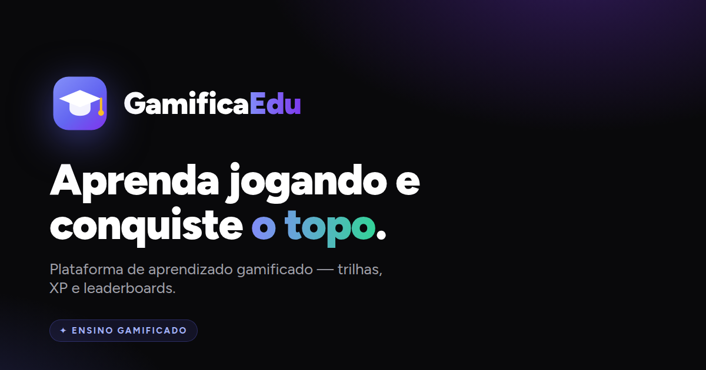

<p align="center">
  
</p>

# GamificaEdu 🚀

🌐 [Português (Brasil)](README.md) · **English**

> **Gamified Learning & Multidisciplinary Teaching Management Platform**

GamificaEdu is a modern ecosystem for K-12 and higher education, built with **Laravel 13**, **InertiaJS** and **Vue 3**. The platform uses gamification to engage students through points (XP), learning tracks, classes and leaderboards — with **internationalization (pt_BR / en)** support.

---

## 🛠️ Tech Stack

- **Backend**: Laravel 13 (PHP 8.4+)
- **Frontend**: Vue 3 (Composition API) with InertiaJS (SPA)
- **Styling**: TailwindCSS (premium, deterministic, responsive dark theme)
- **Validation**: Form Requests (validation + authorization) and JsonResources (serialization)
- **Queue/Jobs**: Laravel Queue (Database / Redis)
- **Environment**: Docker via **Laravel Sail** (PHP 8.5, MySQL 8.4, Redis, Mailpit)
- **Supported Databases**: MySQL / PostgreSQL / SQLite
- **i18n**: `lang/` files (pt_BR and en) exposed to the frontend via the `__()` helper
- **Quality**: Pest (128 tests), PHPStan (level 5 / Larastan), Laravel Pint, Rector and ESLint + Prettier — orchestrated via `composer quality`

---

## 🎨 Visual Identity


The brand blends **education** (the graduation cap) and **gamification** (the achievement *badge*, with the **amber** tassel standing in for the XP spark). The same symbol serves as logo, favicon and PWA icon — and the **Indigo → Violet** gradient is the platform's signature, over a premium, deterministic dark theme.

<br clear="left" />

### Palette

| Color | Usage | Hex |
|-------|-------|-----|
| **Indigo** | Brand · primary actions · focus | `#6366F1` |
| **Violet** | Brand gradient | `#7C3AED` |
| **Emerald** | Progress · XP earned · success | `#10B981` |
| **Amber** | Achievements · podium · point badges | `#F59E0B` |
| **Rose** | Errors · risk | `#F43F5E` |
| **Zinc 950** | Base surface (dark) | `#09090B` |

### Typography & Icons

- **Figtree** (weights 400–900) — geometric, modern and highly legible on screens, from headings to UI labels.
- **Lucide** — icon library (2px stroke, rounded corners), consistent with the brand.

---

## 🏛️ Architecture

The backend follows a senior single-responsibility pattern:

- **Single-action controllers** (`__invoke`) — one action per controller, with no queries (business rules only).
- **Form Requests** for validation and authorization.
- **Resources** for response serialization (Inertia).
- **Actions** for database writes (transactional cases).
- **Services** for integrations and orchestration (e.g. dashboards, ranking, email).
- **Policies** for per-model authorization (auto-discovered).
- **Observers** for lifecycle rules (e.g. unique subject/institution slug generation).
- **Events & Listeners** for decoupled side effects (e.g. `MilestoneReached`, last-login update).
- **String-backed Enums** (`UserRole`, `GeneralStatus`, `ScoreSource`, `ReportStatus`, `SupportStatus`).
- **Lean models** with reusable scopes and traits (`HasRoles`, `Activatable`, `BelongsToInstitution`).

---

## 🌟 Key Features

### 👑 Super Administrator
- **Multi-institution**: CRUD of schools/universities (with CNPJ validation).
- **Global management**: users, subjects and **classes** across all institutions.
- **Student↔class link**: when creating/editing a student, can enroll them in a class.
- **Queued log pruning**, **access metrics** (encrypted IP), **failed jobs** (retry/delete) and **impersonation** for support.

### 🏫 Institution Administrator
- **Context switching** between managed institutions.
- **Teacher & student management** (CRUD with reactive search by name, email and class).
- **Subjects** with teacher assignment.
- **Classes**: create institution classes, assign **one teacher** and several **subjects**, and enroll students.

### 👨‍🏫 Teacher
- **Dedicated sidebar**: My Classes, My Students and Subjects.
- **Dashboard with real, reactive metrics** (classes, students, subjects) + **performance charts** (per class and per student), auto-refreshing.
- **Student registration** and enrollment into one of their classes.
- **Subject management**: link a subject to one of their classes, manage materials (readings), tests (quizzes) and a question bank — with integrity validation (correct-answer index bounded by the options) and idempotent automatic content generation (mock AI).

### 🎓 Student
- **Learning track**: subjects from the classes they are enrolled in, with dynamic progress.
- **Interactive activities**: quizzes with automatic grading and XP proportional to correct answers.
- **Leaderboard**: Global, per Institution and per Subject, with pagination, sorting and search.

### 🌐 Public Site
- Landing page with real platform metrics and SEO (sitemap + Schema.org).
- **Legal pages**: **Privacy Policy** (LGPD) and **Usage Guidelines** (bilingual).
- **Cookie consent banner** with links to the legal pages.

---

## 🧩 Classes

The layer connecting teachers, subjects and students:

- A **class belongs to an institution** and has **at most one teacher**.
- A **teacher can have many classes**.
- A **class can have many subjects**.
- **Students are enrolled in classes** (teacher, admin or super admin can link them).
- The teacher responsible for a class automatically gains access to its subjects' content.

---

## 🔑 Advanced Authentication

- **Magic Login Token**: access via a single-use signed link sent by email (expires in 15 min).
- **Remember Me** integrated into the login flow.
- **Single-session control**: a new login ends previous sessions.
- **Force password change** on first access for admin-created accounts.

---

## ⚡ Setup & Run (Laravel Sail — recommended)

The project runs in Docker containers via Laravel Sail.

```bash
# 1. Environment variables
cp .env.example .env

# 2. Install PHP dependencies (via an ephemeral container)
docker run --rm -v $(pwd):/var/www/html -w /var/www/html laravelsail/php84-composer:latest composer install

# 3. Start the containers (app, mysql, redis, mailpit)
./vendor/bin/sail up -d

# 4. App key, migrations and demo seed
./vendor/bin/sail artisan key:generate
./vendor/bin/sail artisan migrate --seed

# 5. Frontend dependencies and build
./vendor/bin/sail npm install
./vendor/bin/sail npm run dev
```

> The queue runs via `QUEUE_CONNECTION` (database/redis). To process emails and background jobs:
> ```bash
> ./vendor/bin/sail artisan queue:work
> ```

### Without Sail (local PHP 8.4+)

```bash
composer install
npm install
cp .env.example .env && php artisan key:generate
php artisan migrate --seed
php artisan queue:work      # in one terminal
php artisan serve           # in another
npm run dev                 # in another
```

---

## 🧪 Quality & Tests

`composer quality` runs the whole pipeline in order: **Rector → Pint → PHPStan → ESLint → Pest**.

```bash
# Full pipeline (prefix ./vendor/bin/sail when using Sail)
composer quality

# Individual commands
composer pest            # Tests (Pest) — 116 tests
composer pint            # Code style (Laravel Pint)
composer phpstan         # Static analysis (PHPStan / Larastan, level 5)
composer rector          # Automated refactors (Rector)
composer rector:check    # Rector in dry-run mode
composer lint:vue        # Frontend lint (ESLint + Prettier)
```

### Continuous Integration

- `.github/workflows/quality.yml` — on every push/PR: dependency install, **Rector (check)**, **Pint**, **PHPStan**, **ESLint**, the Vite build and the **Pest** suite (PHP 8.4).
- `.github/workflows/release.yml` — after CI passes on `main`, it **bumps the version**, writes the `VERSION` file, creates the **`vX.Y.Z` tag** and the **GitHub Release** with auto-generated notes.

---

## 🏷️ Versioning & Releases

- The single application version lives in the **`VERSION`** file at the root (currently `0.1.0`).
- The version is **exposed on every dashboard** (via `HandleInertiaRequests`) and updated automatically by the release workflow.
- A _patch_ bump is automatic; a manual _minor/major_ bump in the `VERSION` file is honored by the pipeline.

---

## 🌍 Internationalization (i18n)

- UI strings live in `lang/pt_BR/*.php` and `lang/en/*.php`. The groups shared with the frontend via Inertia are: `ui`, `nav`, `admin`, `teacher`, `superadmin`, `student`, `misc` and `classrooms`.
- The frontend uses the global **`__('group.key')`** helper (mirroring Laravel's `__()`), with placeholder support (`:name`).
- Large content (e.g. legal pages in `lang/{locale}/legal.php`) is delivered as page _props_ — it does not travel in the global translations payload.

---

Built to revolutionize educational engagement with modern development best practices. 🌟
